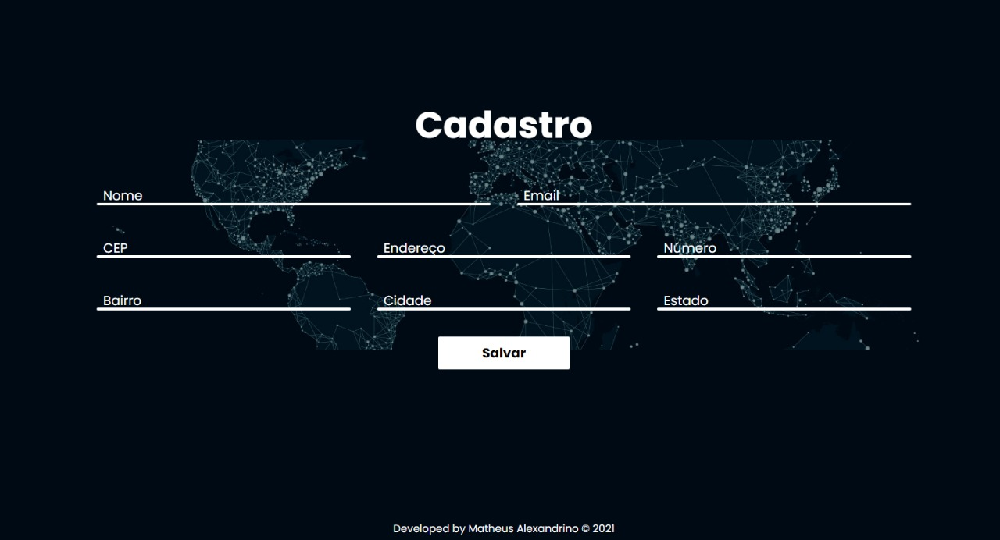

  
  <!-- 
  
  
  
  -->

Descrição do projeto:

Projeto feito com a finalidade de consumir uma API, populando campos do formulário de cadastro automaticamente.

Código fonte: <a href="https://matheus-alexandrino.github.io/api-correios-js/"><i class="large github icon"></i>Matheus-Alexandrino/api/correios-js/</a>

